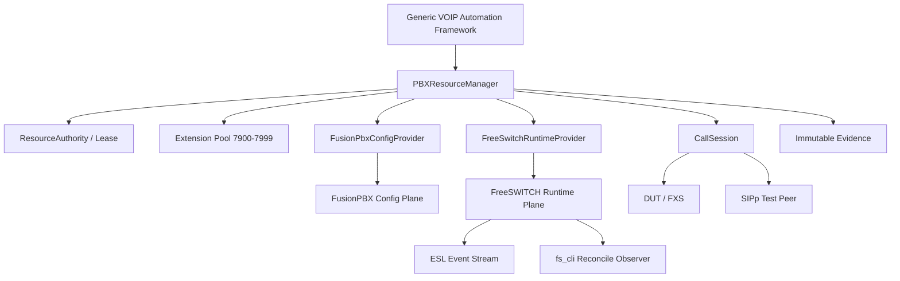
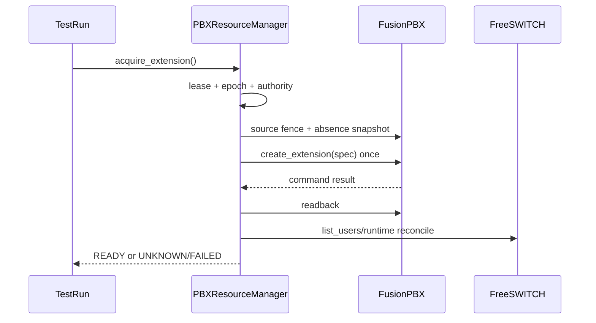

# VOIP AI——FusionPBX / FreeSWITCH 测试基础设施详细设计 V1.0

状态：DESIGN FROZEN / IMPLEMENTATION READY  
日期：2026-09-09  
代码基线：`c882f34959ab6cfee6010e3389ffd1aa5d11b9f6`  
现网基线：FusionPBX `/var/www/fusionpbx`；FreeSWITCH 1.10.12；internal `10.51.230.212:5060`  
关联：Generic VOIP Automation Framework V1（Production CLOSED）

## 1. 目标

将当前“可观察的共享 FusionPBX/FreeSWITCH”升级为受控、可租赁、可恢复、可审计的 VOIP Test Lab Resource。第一阶段必须支持动态分机资源、真实注册观察和 Call Session，为后续 SIP/FXS Call E2E Golden 提供稳定基础设施。

本设计不重装现有 FusionPBX/FreeSWITCH，不创建第二套 PBX，不允许自动化直接裸 SQL 修改 FusionPBX 数据库。

## 2. 当前事实基线

- 当前正式 PBX observer：`backend/app/automation/adapters/pbx/registration.py::FusionPbxRegistrationProbe`。
- 当前 observer 只执行 `show registrations` 与 `sofia status profile internal reg`，不得 mutation。
- Controlled runner 已验证 FusionPBX provider source 存在 `extension.exists/delete`、`number_alias`、`password`、`accountcode`、`enabled` 与 `database->save()` 路径。
- 当前真实 baseline extension 为 `7102`，属于人工/环境长期基线，不允许自动 cleanup 删除。
- 自动化临时号码池第一版冻结为 `7900-7999`。

## 3. 架构原则

1. **FusionPBX = Config Plane / Desired State**：负责 Domain、Extension、Alias、Password、Caller ID、Enabled 与路由配置。
2. **FreeSWITCH = Runtime Plane / Observed State**：负责 REGISTER、Channel、Call、DTMF、Hangup 与 runtime event。
3. `CONFIGURED != READY`；只有 FusionPBX readback 与 FreeSWITCH runtime 均满足条件，资源才可进入 READY。
4. 所有 PBX mutation 必须经过 Resource Authority、Lease、Source Fence、Snapshot/Absence Snapshot、Readback、Cleanup、Reverse Verify。
5. UNKNOWN 必须 observe-before-retry；禁止 blind mutation retry。
6. Cleanup failure 是测试失败，不是 warning；Authority 必须 release-last。
7. Secret 只进入任务私有运行时，不得进入 Evidence、日志、LLM 或普通 Audit。

## 4. 总体架构



## 5. 核心组件

### 5.1 PBXResourceManager

统一对上层暴露资源能力，不允许上层直接调用 FusionPBX PHP、数据库或 `fs_cli` mutation。

最小接口：

```text
discover_nodes()
health_check()
acquire_extension(criteria)
release_extension(lease)
provision_extension(lease, spec)
update_extension(lease, patch)
restore_extension(lease, snapshot)
deprovision_extension(lease)
wait_registered(identity)
wait_unregistered(identity)
create_call_session(spec)
cleanup_call_session(session)
```

### 5.2 FusionPbxConfigProvider

允许：使用 FusionPBX 自身 bootstrap/class/database save 路径创建、修改、读取、删除由自动化拥有的临时 extension。  
禁止：直接执行裸 `INSERT/UPDATE/DELETE v_extensions`。

接口：

```text
discover_domains()
extension_exists(number)
get_extension(number)
create_extension(spec)
update_extension(number, patch)
delete_extension(number)
create_alias(extension, alias)
remove_alias(extension)
snapshot_extension(number)
verify_extension(spec)
```

### 5.3 FreeSwitchRuntimeProvider

保留现有 `FusionPbxRegistrationProbe` 作为 read-only reconcile/fallback observer；新增 ESL 驱动的 runtime provider。

接口：

```text
list_registrations()
get_registration(identity)
wait_registered(identity)
wait_unregistered(identity)
originate(call_spec)
hangup(call_uuid)
wait_ringing(call_uuid)
wait_answered(call_uuid)
wait_hangup(call_uuid)
send_dtmf(call_uuid, digits)
collect_call_evidence(call_uuid)
```

ESL 第一阶段订阅事件至少包括：REGISTER/UNREGISTER（可由 custom/reconcile 归一）、CHANNEL_CREATE、CHANNEL_PROGRESS、CHANNEL_ANSWER、DTMF、CHANNEL_HANGUP_COMPLETE。

## 6. Resource Model

### 6.1 PBX Node

```text
pbx_node_id
provider=fusionpbx
runtime_provider=freeswitch
host=10.51.230.212
fusionpbx_root=/var/www/fusionpbx
internal_profile=internal
internal_port=5060
status
source_fence_version
last_health_at
```

### 6.2 Extension Resource

```text
id
pbx_node_id
domain_id
extension
resource_type = STATIC_BASELINE | TEMPORARY_AUTOMATION
state
lease_id
lease_epoch
owner_run_id
created_by_automation
ownership_marker
last_health_at
last_cleanup_at
dirty_reason
```

状态机：

```text
FREE -> RESERVED -> PROVISIONING -> READY -> IN_USE -> CLEANUP -> FREE
                      |              |        |          |
                      +--------------+--------+----------+-> DIRTY -> RECOVERING
```

`7102`：`STATIC_BASELINE`、`deletable=false`。  
`7900-7999`：候选 `TEMPORARY_AUTOMATION`；只有实际自动创建并写入 ownership marker 后才允许 delete。

## 7. Ownership 与删除保护

自动化创建资源必须写入可回读 ownership marker，例如：

```text
AIVOIP_AUTOMATION:<run_id>:<lease_epoch>
```

删除前必须同时满足：

- resource_type=`TEMPORARY_AUTOMATION`；
- ownership marker 与当前 run/lease 匹配；
- lease epoch 未失效；
- 不是保护列表/baseline extension；
- 当前没有其它 active CallSession 使用资源。

任一条件不能证明时返回 `PBX_RESOURCE_OWNERSHIP_UNPROVEN`，禁止删除。

## 8. Source Fence

PBX mutation 前必须校验已绑定的 FusionPBX provider source contract。V1 至少 fence：

- `resources/require.php`
- `resources/classes/database.php`
- `app/extensions/resources/classes/extension.php`
- create/update provider 使用的受控脚本/路径

Source hash 或 contract facts 不匹配：`PBX_PROVIDER_SOURCE_FENCE_FAILED`，只允许 read-only observation。

## 9. Provision Transaction



如果 create 返回 UNKNOWN，不得再次 create；必须先 `extension_exists + ownership readback` 决定前一次是否已经落地。

## 10. Cleanup / Recovery

Temporary resource cleanup：

```text
stop/hangup active call
-> verify no active CallSession
-> delete owned extension once
-> FusionPBX readback absent
-> FreeSWITCH wait_unregistered/absence
-> mark FREE
-> release extension lease
-> release PBX authority last
```

Baseline mutation cleanup：必须以 fresh-current state 为基底，仅回滚本测试声明修改的字段；禁止盲目完整覆盖陈旧 snapshot。

Cleanup 失败：资源进入 `DIRTY`，禁止新测试分配；Reconciler 进入 `RECOVERING`，保留 Evidence。

## 11. CallSession

```text
id
run_id
freeswitch_uuid
caller_resource_id
callee_resource_id
direction
state
created_at
ringing_at
answered_at
hangup_at
hangup_cause
sip_evidence_refs
rtp_evidence_refs
dtmf_evidence_refs
```

状态：`CREATED -> ORIGINATING -> RINGING -> ANSWERED -> MEDIA -> HANGUP -> COMPLETED`；异常终态：BUSY/NO_ANSWER/REJECTED/FAILED/TIMEOUT。

## 12. SIP Test Peer

Call E2E V1 引入 SIPp 作为可编程 peer，负责自动 REGISTER/INVITE/answer/BYE/DTMF。SIPp peer 使用与 PBX extension 相同的 Resource Lease，不得使用固定共享账号无锁并发。

FXS 实体摘挂机、按键等物理动作不属于本基础设施 V1 的必需范围；后续可接 Phone Simulator/Relay/Test Instrument。

## 13. 数据库变更

建议新增：

```text
pbx_nodes
pbx_extension_resources
pbx_resource_leases
pbx_mutation_snapshots
pbx_call_sessions
```

关键 lease/resource/status/domain/extension/owner_run_id 必须正式列化；扩展 provider metadata 可 JSONB。不得把完整 ResourceManager 状态塞进单一 JSONB。

## 14. Health Gate

每次 PBX mutation 前必须通过 `PBX_READY`：

- FusionPBX root/source fence 可读；
- FusionPBX database 可用；
- FreeSWITCH process 可用；
- internal profile RUNNING；
- 5060 runtime reachable；
- ESL reachable（进入 M4 后强制）；
- extension pool 可枚举；
- 无阻断级 DIRTY resource；
- ResourceAuthority/lease store 可用。

## 15. Evidence 与审计

正式 Evidence 不记录 password、ESL secret、数据库 secret。最小结果：

```json
{
  "provider": "fusionpbx",
  "runtime": "freeswitch",
  "extension": "7900",
  "configured": true,
  "registered": true,
  "registration_identity": "7900",
  "mutation_executed": true,
  "secret_values_emitted": false,
  "lease_epoch": 1,
  "cleanup": "PASS"
}
```

原始 `fs_cli`/ESL 大输出可进入受控私有 artifact；对外 Evidence 只保留结构化结论与必要 reference。

## 16. Error Contract

第一批错误码：

```text
PBX_NOT_READY
PBX_PROVIDER_SOURCE_FENCE_FAILED
PBX_RESOURCE_POOL_EXHAUSTED
PBX_RESOURCE_BUSY
PBX_RESOURCE_OWNERSHIP_UNPROVEN
PBX_EXTENSION_ALREADY_EXISTS
PBX_EXTENSION_NOT_FOUND
PBX_MUTATION_UNKNOWN
PBX_READBACK_MISMATCH
PBX_RUNTIME_NOT_APPLIED
PBX_REGISTRATION_TIMEOUT
PBX_CALL_TIMEOUT
PBX_CALL_FAILED
PBX_CLEANUP_FAILED
PBX_RESOURCE_DIRTY
```

## 17. Golden Gate

### G-PBX-001 Extension Lifecycle
`acquire 7900 -> create -> readback -> FreeSWITCH visible -> delete -> absent -> release`。

### G-PBX-002 Registration Lifecycle
`acquire/provision 7900 -> DUT WEB configure -> REGISTER 7900 -> DUT restore -> PBX cleanup -> unregistered -> release`。

### G-CALL-001 SIP Call E2E
`7901 peer -> 7900 DUT -> RINGING -> ANSWER -> RTP -> DTMF -> BYE -> reverse cleanup`，并补反向呼叫。

所有 Golden 必须包含 failure injection：timeout/UNKNOWN、duplicate request、cleanup crash、stale lease、ownership mismatch。

## 18. 里程碑

| 里程碑 | 内容 | 退出条件 |
|---|---|---|
| M1 | Inventory + PBXHealthGate | read-only `PBX_READY` 稳定 |
| M2 | FusionPbxConfigProvider | G-PBX-001 PASS |
| M3 | Extension Pool + Lease | 并发/过期/dirty recovery contract PASS |
| M4 | FreeSwitchRuntimeProvider + ESL | 注册/Call 事件结构化且 reconcile 一致 |
| M5 | SIPp Peer + CallSession | G-CALL-001 signaling PASS |
| M6 | Framework/CI/Production Integration | Golden + cleanup + immutable evidence + exact-head Gate PASS |

## 19. 非目标

V1 不建设多 PBX 节点调度、FusionPBX HA、FreeSWITCH cluster、PSTN trunk 大规模治理、复杂 IVR/Call Center、性能压测平台、物理 FXS 机器人。以上进入后续 Test Lab Infrastructure V2。

## 20. 完成定义

只有以下全部满足才可将 PBX Infrastructure V1 标记 CLOSED：provider mutation contract、source fence、lease/ownership、cleanup/recovery、ESL runtime observation、G-PBX-001、G-PBX-002、G-CALL-001、failure injection、exact-head acceptance 与生产/测试环境 readback 全部 PASS。
