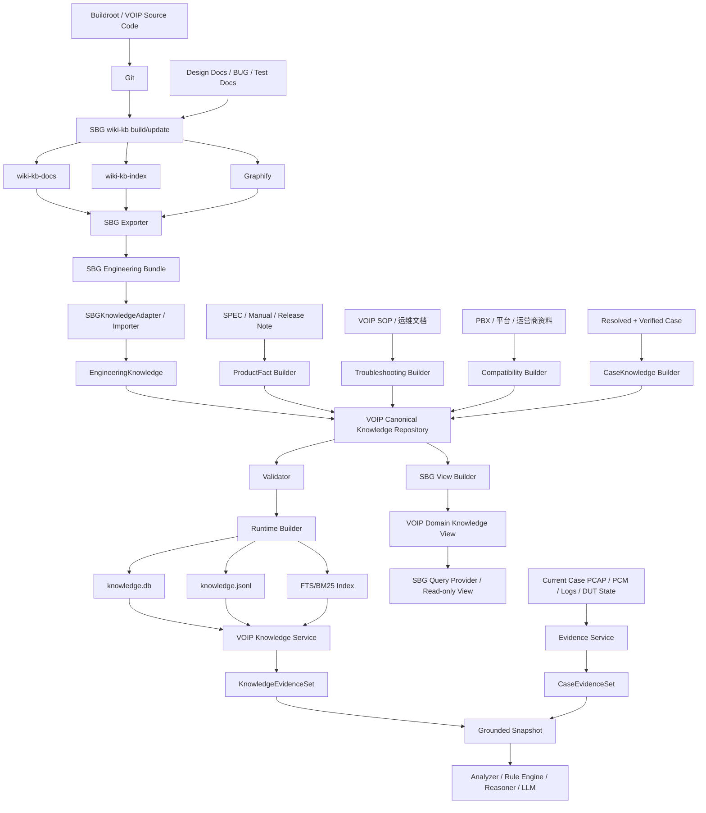
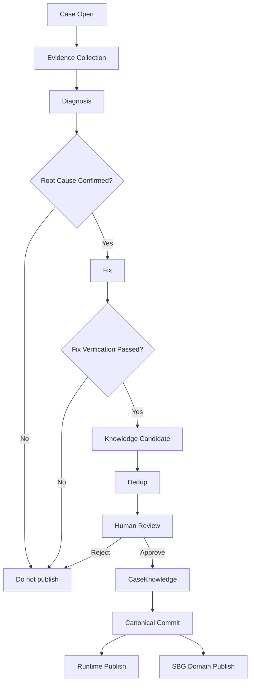

# VOIP AI 助手知识库整体详细设计方案 V1.0

> 日期：2026-08-30  
> 状态：Detailed Design / 可进入实现  
> 目标：在复用现有 SBG wiki-kb 的前提下，建立一套同时服务于本地研发 Agent 与 VOIP AI 故障助手的统一知识体系。  
> 核心原则：**工程知识由 SBG 生产；领域知识由 VOIP Canonical Knowledge 治理；两端双向共享，但禁止双主写入。**

---

# 1. 设计目标

本方案解决 6 个问题：

1. 如何复用本地 SBG wiki-kb 已经生成的代码/设计知识；
2. 如何补足 VOIP AI 助手需要的产品事实、排障 SOP、兼容性和历史 Case；
3. 如何让两端共享同一批知识资产，而不是维护两套互相漂移的知识库；
4. 如何支持 SBG 端后续持续更新并自动同步给 VOIP AI；
5. 如何让 VOIP AI 新沉淀的 ProductFact / SOP / CaseKnowledge 反向给 SBG 使用；
6. 如何保证 Knowledge 不越权替代当前 Case Evidence 做正式根因判断。

---

# 2. 总体架构



---

# 3. 核心边界

## 3.1 SBG 的职责

SBG 继续负责其最擅长的工程知识：

- 代码架构；
- 模块边界；
- 调用链；
- API；
- Workflow；
- ADR；
- 测试知识；
- 历史代码 BUG；
- Git baseline；
- Graphify 结果。

SBG 是 **EngineeringKnowledge 的 Source of Truth / Producer**。

## 3.2 VOIP Canonical Knowledge 的职责

VOIP Canonical Knowledge 负责统一治理：

- ProductFact；
- DocumentationKnowledge；
- TroubleshootingUnit；
- CompatibilityFact；
- CaseKnowledge；
- Imported EngineeringKnowledge；
- Scope；
- Version；
- Authority；
- Approval；
- Conflict；
- Runtime Publish。

Canonical 是 **领域知识治理与统一发布层**，不是工程知识的原始真相源。

## 3.3 Current Case Evidence 的职责

以下内容不进入长期知识库：

- 当前 PCAP；
- 当前 PCM；
- 当前设备日志；
- 当前设备状态；
- 当前诊断中的临时假设；
- 尚未完成 Fix Verification 的结论。

它们只存在于：

```text
Case Evidence Service
```

当前 Case 正式根因判断必须基于 Evidence + Analyzer + Rule，而不是 Knowledge 单独决定。

---

# 4. 双主禁止与知识所有权

为避免同步冲突，每类知识只有一个 Owner。

| 知识类型 | Owner | 其他系统权限 |
|---|---|---|
| EngineeringKnowledge | SBG / Git | VOIP 只读 + enrichment |
| ProductFact | VOIP Canonical | SBG 只读 |
| DocumentationKnowledge | VOIP Canonical | SBG 只读 |
| TroubleshootingUnit | VOIP Canonical | SBG 只读 |
| CompatibilityFact | VOIP Canonical | SBG 只读 |
| CaseKnowledge | VOIP Canonical | SBG 只读 |
| Current Case Evidence | Case/Evidence Service | 不同步为长期知识 |

EngineeringKnowledge 建议分为：

```yaml
source_payload:
  # SBG-owned，不允许 VOIP 修改
voip_enrichment:
  # VOIP-owned，可增加 scope/authority/tag
```

SBG 更新时只替换 `source_payload`，保留 `voip_enrichment`。

---

# 5. 知识类型模型

## 5.1 EngineeringKnowledge

```yaml
id: engineering://<repo>/<module>/<knowledge-key>
type: ENGINEERING_KNOWLEDGE

subtype:
  # ARCHITECTURE | WORKFLOW | API | DOMAIN | ADR | OPERATION | TESTING

source_payload:
  title:
  content:
  module:
  code_paths: []
  sbg_document:
  sbg_section:
  graph_refs: []
  source_repo:
  source_branch:
  source_commit:
  sbg_kb_commit:
  content_hash:

voip_enrichment:
  product_scope: []
  hardware_revision_scope: []
  software_version_scope: []
  region_scope: []
  tags: []
  authority_level: L2
  approval_status: IMPORTED

lifecycle:
  status: ACTIVE
  imported_at:
  superseded_by:
```

### 关键约束

- 不能自动转成 ProductFact；
- `source_commit` 必须存在；
- 若 Scope 无法判断，标记 UNKNOWN，不能默认 GLOBAL；
- 内容更新用 stable ID + hash 判断。

---

## 5.2 ProductFact

适用于：

- 支持 / 不支持；
- 默认值；
- 最大 / 最小；
- Codec；
- SIP transport；
- DTMF；
- FXS 数量；
- SIP account 数量；
- 协议版本；
- 平台能力。

```yaml
id: productfact://<product>/<feature>/<scope-key>
type: PRODUCT_FACT

product_model:
hardware_revision_scope: []
software_version_scope:
  min:
  max:
  exact: []
region_scope: []

feature_key:
value:
value_type:
unit:

source:
  type: SPEC
  ref:
  section:
  content_hash:

authority_level: L3
approval_status: VERIFIED

effective_from:
effective_to:
supersedes:
status: ACTIVE
```

### 关键约束

Strict Fact 查询必须优先此类数据，不允许只基于 Wiki/Code 推断。

---

## 5.3 DocumentationKnowledge

```yaml
id: document://<source>/<section>
type: DOCUMENTATION

title:
content:
keywords: []

scope:
  product_model: []
  hardware_revision: []
  software_version: []
  region: []

source:
  type:
  ref:
  section:
  content_hash:

authority_level:
approval_status:
```

V1 用于解释、配置说明、操作说明；不承担严格事实唯一来源。

---

## 5.4 TroubleshootingUnit

```yaml
id: troubleshooting://<domain>/<symptom>/<seq>
type: TROUBLESHOOTING_UNIT

symptom:
  category:
  description:
  observable_signals: []

applicable_scope:
  product_model: []
  platform: []
  hardware_revision: []
  software_version: []
  region: []
  pbx_vendor: []
  pbx_model: []

preconditions: []

checks:
  - check_id:
    purpose:
    required_evidence:
    capability_id:
    expected:
    abnormal:
    next_if_normal:
    next_if_abnormal:

possible_causes:
  - cause_id:
    description:
    prior_weight:

recommended_capabilities: []

stop_conditions: []

source:
  type: SOP
  ref:
  section:
  content_hash:

authority_level: L2
approval_status: REVIEWED
status: ACTIVE
```

### 关键约束

- 不直接保存“让 LLM 执行的 shell”作为自动动作；
- 自动动作必须指向 `capability_id`；
- Capability 由 Action Engine / Platform Adapter 安全执行；
- “经验上大概率”只能是 prior，不是 root cause。

---

## 5.5 CompatibilityFact

```yaml
id: compatibility://<vendor>/<model>/<feature>/<scope>
type: COMPATIBILITY_FACT

subject:
  type: PBX
  vendor:
  model:
  version:

peer_scope:
  product_model: []
  software_version: []

feature:
  key:
  value:
  status:
  # SUPPORTED | UNSUPPORTED | PARTIAL | KNOWN_ISSUE | UNKNOWN

constraints: []
known_issues: []

source:
  type:
  ref:
  section:
  content_hash:

authority_level:
approval_status:
status: ACTIVE
```

---

## 5.6 CaseKnowledge

仅允许来自：

```text
Root Cause confirmed
+
Fix completed
+
Fix Verification passed
```

```yaml
id: caseknowledge://<case-id>
type: CASE_KNOWLEDGE

symptom_signature:
  category:
  description:
  signals: []

environment:
  product_model:
  hardware_revision:
  software_version:
  region:
  pbx_vendor:
  pbx_model:
  topology:

trigger_conditions: []

evidence_signature:
  sip: []
  rtp: []
  pcm: []
  logs: []
  device_state: []

first_abnormal_boundary:

confirmed_root_cause:
  category:
  description:

excluded_causes: []

fix:
  type:
  description:
  commit:
  version:

verification:
  method:
  result:
  aba_result:
  regression:

applicable_scope: {}
non_applicable_scope: {}

source_case:
approval_status: VERIFIED
authority_level: L3
status: ACTIVE
```

### 关键约束

- 未验证 Case 不允许进入正式 CaseKnowledge；
- 历史 Case 只能用于相似性/优先级；
- 不允许“症状类似 → 自动复制根因”。

---

# 6. Source Registry

所有知识必须可追溯到源。

```yaml
source_id:
source_type:
# CODE | SBG | SPEC | MANUAL | RELEASE_NOTE | SOP | CASE | TEST | BUG | OTHER

uri:
repo:
branch:
commit:
document_version:
content_hash:

owner:
approval_state:
effective_from:
effective_to:

last_seen_at:
```

Source Registry 负责：

- 权威来源管理；
- 文档失效；
- 版本替换；
- hash 对比；
- 同源重复检测；
- 来源审计。

---

# 7. Authority 与 Grounding

建议统一：

```text
L0：模型常识 / 无来源
L1：未审核资料 / 弱来源
L2：审核 SOP / SBG Engineering / 测试资料
L3：正式 SPEC / ProductFact / Verified Case
L4：当前 Case Evidence / Analyzer Finding
```

问题类型决定优先级。

## 7.1 实现类问题

```text
当前代码 / Graphify
> SBG EngineeringKnowledge
> 设计文档
```

## 7.2 正式产品能力

```text
ProductFact / 当前有效 SPEC
> Manual
> Release Note
> 当前代码实现
> SBG Wiki
```

## 7.3 当前故障根因

```text
Current Case Evidence
> Analyzer deterministic Finding
> Rule Engine
> Verified CaseKnowledge
> TroubleshootingUnit
> EngineeringKnowledge
> General Documentation
> LLM prior
```

---

# 8. SBG → VOIP 同步设计

## 8.1 首次同步

```text
SBG Build
→ wiki-kb-docs/
→ wiki-kb-index/
→ Graphify
→ Export Manifest
→ SBG Engineering Bundle
→ Importer
→ EngineeringKnowledge
→ Validate
→ Canonical Commit
```

## 8.2 后续增量同步

```text
Code Change
→ git commit
→ wiki-kb-update
→ SBG KB commit
→ Export
→ diff manifest
→ Importer
→ incremental upsert
→ validation
→ runtime publish
```

## 8.3 Export Bundle

建议格式：

```text
sbg-export/
├── manifest.yaml
├── wiki-kb-docs/
├── wiki-kb-index/
├── graph/
└── checksums.sha256
```

manifest：

```yaml
schema_version: "1.0"

source:
  repo:
  branch:
  code_commit:

sbg:
  kb_commit:
  baseline_commit:
  wiki_kb_version:
  graphify_version:

scope:
  modules: []
  product_families: []
  software_versions: []

changes:
  added: []
  updated: []
  removed: []

artifacts:
  docs:
  index:
  graph:

content_hash:
generated_at:
```

---

# 9. Incremental Import 算法

每个 EngineeringKnowledge 必须有 stable ID：

```text
engineering://repo/module/knowledge-key
```

Importer 规则：

```text
ID不存在
→ INSERT

ID存在 + content_hash相同
→ NOOP

ID存在 + content_hash变化
→ UPDATE source_payload

旧ID不再出现在新的有效 Scope
→ RETIRE/STALENESS CANDIDATE

不允许立即物理删除
```

### Removed 的处理

优先：

```yaml
status: RETIRED
retired_at:
retired_by_source_commit:
```

保留历史追溯。

---

# 10. VOIP → SBG 反向共享设计

不允许让 SBG 直接编辑 VOIP Canonical Domain Knowledge。

推荐 Provider 方式。

```text
/wiki-kb-query
  ├── LocalEngineeringProvider
  │    ├── wiki
  │    ├── Graphify
  │    └── code
  │
  └── VOIPDomainProvider
       ├── ProductFact
       ├── TroubleshootingUnit
       ├── CompatibilityFact
       └── CaseKnowledge
```

## 10.1 V1 兼容模式

生成只读：

```text
generated/sbg-domain-view/
├── product/
├── troubleshooting/
├── compatibility/
└── cases/
```

SBG Query 把它作为 External Read-only Knowledge。

## 10.2 V2 推荐模式

`wiki-kb-query` 增加 Provider Plugin：

```python
query_local_engineering(...)
query_voip_domain(...)
```

严格事实直接走 VOIP Domain Provider；
代码问题继续走 SBG 本地 Provider。

---

# 11. Runtime Knowledge Service

## 11.1 接口

```text
POST /knowledge/query
```

请求：

```json
{
  "query": "R412 某型号支持哪些 DTMF 模式？",
  "context": {
    "case_id": null,
    "product_model": "xxx",
    "hardware_revision": "V1",
    "software_version": "R412",
    "region": "CN",
    "pbx_vendor": null,
    "pbx_model": null,
    "symptom": null,
    "query_type": "STRICT_FACT"
  }
}
```

返回：

```json
{
  "query_type": "STRICT_FACT",
  "scope_resolution": {
    "product_model": "xxx",
    "software_version": "R412",
    "status": "RESOLVED"
  },
  "items": [
    {
      "knowledge_id": "...",
      "type": "PRODUCT_FACT",
      "content": "...",
      "authority_level": "L3",
      "source_ref": "...",
      "applicability": "MATCH"
    }
  ],
  "conflicts": [],
  "grounding_level": "L3",
  "abstain": false
}
```

---

# 12. Query Router

建议 Query Type：

```text
STRICT_FACT
EXPLANATION
PROCEDURE
ENGINEERING
COMPATIBILITY
SIMILAR_CASE
MIXED
```

路由规则：

```text
STRICT_FACT
→ ProductFact first

PROCEDURE
→ Troubleshooting + Documentation

ENGINEERING
→ EngineeringKnowledge + SBG fallback

COMPATIBILITY
→ CompatibilityFact

SIMILAR_CASE
→ CaseKnowledge

MIXED
→ parallel retrieval + conflict resolver
```

---

# 13. Retrieval V1

第一阶段不强制 Vector DB。

采用：

1. Structured exact lookup；
2. SQLite；
3. SQLite FTS5；
4. BM25；
5. keyword / exact；
6. SBG index；
7. Graphify/code fallback（仅 Engineering）。

### 为什么暂不强制 Vector

VOIP 场景大量高价值 token 是：

```text
aimd.s
RC1
rff_cnt
tfe_cnt
pcm_rx
pcm_tx
RFC2833
G711A
G711U
SIP 401
```

Exact / FTS / BM25 非常有效。

后续如果 CaseKnowledge 数量大、自然语言召回不足，再新增 Embedding Provider，不改变 Canonical Schema。

---

# 14. Scope Resolver

输入：

```yaml
product_model:
hardware_revision:
software_version:
region:
pbx_vendor:
pbx_model:
platform:
```

输出：

```yaml
matched:
unknown:
conflicts:
confidence:
```

匹配顺序：

```text
Exact Version
> Version Range
> Product Family
> Platform
> Global
```

若知识没有 Scope：

```text
UNKNOWN
```

不能自动当：

```text
GLOBAL
```

---

# 15. Conflict Resolver

典型冲突：

### 代码 vs SPEC

```text
Code: capacity = 16
SPEC/ProductFact: max = 8
```

处理：

```text
正式产品能力问题 → ProductFact = 8
同时生成 Conflict Candidate
```

不允许自动把 ProductFact 改成 16。

### 历史 Case vs 当前 Evidence

```text
历史 Case：卡顿来自 RTP loss
当前 PCAP：RTP loss = 0
```

处理：

```text
Current Case Evidence wins
历史 Case hypothesis weight down
```

### 两份正式文档冲突

返回：

```yaml
conflicts:
  - source_a:
  - source_b:
  - type: VERSION_OR_AUTHORITY_CONFLICT
abstain: true
```

不得由 LLM 自行决定。

---

# 16. Grounded Snapshot

VOIP AI Reasoner 不直接拿整库。

统一输入：

```yaml
grounded_snapshot:
  case_context:
  current_evidence:
  analyzer_findings:
  rule_findings:
  knowledge:
    product_facts:
    troubleshooting:
    engineering:
    compatibility:
    similar_cases:
  conflicts:
  missing_evidence:
  permitted_actions:
```

这样把：

```text
Knowledge
Evidence
Rule
Action
```

四类信息彻底分开。

---

# 17. Troubleshooting 与 Capability Registry 关联

知识条目：

```yaml
check:
  capability_id: VOIP_SHOW_REGISTRATION
```

Capability Registry：

```yaml
id: VOIP_SHOW_REGISTRATION

platforms:
  - mt7621

risk: READ_ONLY

adapter:
  type: ssh_cli
  command_template: "..."

timeout:
cleanup:
evidence_type: VOIP_REGISTRATION_STATE
```

### 原则

LLM：

```text
选择 capability
```

而不是：

```text
自由生成 shell
```

执行仍经过：

```text
Policy
→ Adapter
→ Action Engine
→ Evidence Capture
```

---

# 18. CaseKnowledge 生命周期



---

# 19. ProductFact 生命周期

```text
Source Update
→ Candidate Extraction
→ Scope Extraction
→ Compare Existing Fact
→ Conflict Check
→ Human/Rule Review
→ VERIFIED
→ Publish
→ old fact SUPERSEDED
```

不建议把 LLM extraction 结果直接设为 VERIFIED。

---

# 20. Staleness 与版本失效

每次 Source 更新检查：

```text
content_hash change
source version change
source retired
code baseline moved
release version changed
```

知识状态：

```text
ACTIVE
STALE
SUPERSEDED
RETIRED
DRAFT
REVIEW_REQUIRED
```

Runtime 默认只使用：

```text
ACTIVE + allowed approval status
```

---

# 21. Repo 设计

```text
voip-knowledge/
├── README.md
├── VERSION
├── schema/
├── sources/
│   ├── source_registry.yaml
│   └── manifests/
├── knowledge/
│   ├── engineering/
│   ├── product_facts/
│   ├── documentation/
│   ├── troubleshooting/
│   ├── compatibility/
│   └── cases/
├── enrichments/
│   └── engineering/
├── imports/
│   └── sbg/
├── tools/
│   ├── sbg_importer/
│   ├── source_ingestor/
│   ├── validator/
│   ├── runtime_builder/
│   ├── sbg_view_builder/
│   └── conflict_checker/
├── generated/
│   ├── runtime/
│   │   ├── knowledge.db
│   │   ├── knowledge.jsonl
│   │   ├── fts.db
│   │   └── manifest.json
│   └── sbg-domain-view/
└── tests/
    ├── unit/
    ├── golden_queries/
    ├── conflict/
    ├── scope/
    └── fixtures/
```

---

# 22. CI/CD

Canonical Repo 每次 Merge：

```text
Schema Validate
→ Source Validate
→ Scope Validate
→ Conflict Check
→ Golden Query Regression
→ Runtime Build
→ Runtime Smoke Test
→ SBG View Build
→ Artifact Publish
```

建议 Gate：

```text
SCHEMA_VALIDATION=PASS
SOURCE_TRACEABILITY=PASS
SCOPE_VERSION_ISOLATION=PASS
CONFLICT_GATE=PASS
STRICT_FACT_GOLDEN=PASS
KNOWLEDGE_EVIDENCE_BOUNDARY=PASS
SBG_IMPORT_REGRESSION=PASS
RUNTIME_QUERY_SMOKE=PASS
```

---

# 23. Runtime 发布

建议生成不可变 Bundle：

```text
voip-knowledge-runtime-<version>-<commit>.tar.zst
```

包含：

```text
knowledge.db
fts.db
knowledge.jsonl
manifest.json
checksums.sha256
```

Knowledge Service 启动时：

```text
load bundle
→ checksum verify
→ schema verify
→ open read-only
```

支持：

```text
current
previous
rollback
```

---

# 24. 更新与同步触发

## 24.1 SBG → VOIP

触发条件：

```text
wiki-kb-update 完成
+ KB commit 产生
```

自动：

```text
export
→ publish artifact
→ canonical importer
→ PR / merge
→ runtime publish
```

## 24.2 VOIP → SBG

触发条件：

```text
Canonical Domain Knowledge commit
```

自动：

```text
build SBG read-only view
→ publish artifact / provider endpoint
→ SBG refresh
```

---

# 25. 网络/部署模式

## 模式 A：共享 Git

最推荐：

```text
SBG server
→ Git
→ CI
→ voip-knowledge
→ Runtime
```

## 模式 B：内网制品

```text
SBG
→ tar.gz
→ Artifact/NAS/SCP
→ Importer
```

## 模式 C：完全离线

```text
SBG export bundle
→ U盘/人工转移
→ checksum verify
→ import
```

三种模式使用同一 Manifest / Bundle Contract。

---

# 26. 安全设计

知识库本身需要权限分级：

```text
PUBLIC_PRODUCT
INTERNAL_SUPPORT
INTERNAL_ENGINEERING
RESTRICTED
```

Query Context 带：

```yaml
actor_role:
channel:
case_access:
```

Retrieval Filter 在返回前执行 ACL。

敏感工程内容不允许直接通过飞书面向普通技服输出源码细节。

---

# 27. Citation 设计

每条返回至少包含：

```yaml
knowledge_id:
source_type:
source_ref:
source_version:
source_commit:
section:
content_hash:
```

用户级答案可呈现：

```text
来源：R412 SPEC §x.x
```

研发级答案可呈现：

```text
来源：repo@commit / path / SBG section
```

---

# 28. Golden Eval

至少分 7 类：

1. Strict Fact；
2. Version Difference；
3. Product Difference；
4. Procedure；
5. Engineering；
6. Conflict；
7. Similar Case。

核心指标：

```text
Strict Fact Accuracy
Scope Accuracy
Version Accuracy
Citation Accuracy
Unsupported Claim Rate
Conflict Detection Rate
Abstention Accuracy
Retrieval Recall
Similar Case False Positive Rate
Runtime Latency
```

---

# 29. 首批 Golden Questions 建议

Engineering：

```text
VOIP 配置从界面到 aimd 的链路是什么？
SIP 注册入口在哪里？
Voice VLAN 如何创建？
PCM RX/TX 调试路径是什么？
DTMF 输入经过哪些模块？
```

ProductFact：

```text
某型号支持多少 FXS？
支持哪些 DTMF？
某版本支持 TCP/UDP 哪些 SIP transport？
默认 Codec 是什么？
```

Troubleshooting：

```text
注册不上第一步查什么？
拨号丢号需要哪些证据？
声音卡顿如何区分 RTP / PCM / 设备问题？
```

Conflict：

```text
代码 capacity=16，SPEC max=8，正式回答多少？
```

Case：

```text
症状相同但软件版本不同，是否可复用历史根因？
```

---

# 30. 实施阶段

## M0 架构冻结

完成：

- Owner 模型；
- Canonical Schema；
- 双向同步原则；
- Evidence Boundary。

## M1 SBG Engineering KB

本地完成：

```text
Graphify
→ wiki-kb-build
→ review
→ wiki-kb-docs/index
→ export
```

## M2 Import Contract

根据真实 SBG 产物确定：

- index 格式；
- stable ID；
- metadata；
- Query Provider；
- manifest。

## M3 Canonical Repo V1

实现：

- Schema；
- Validator；
- Source Registry；
- Importer；
- Runtime Builder。

## M4 Troubleshooting V1

将现有 VOIP 排障资料结构化。

## M5 ProductFact / Compatibility V1

导入当前有效 SPEC / Manual / Release Note / PBX资料。

## M6 Runtime Knowledge Service

接入 VOIP AI。

## M7 CaseKnowledge

Case close → candidate → review → publish。

## M8 SBG Reverse Reuse

让 SBG 读取 ProductFact / SOP / CaseKnowledge。

## M9 Release Gate

Golden + Scope + Conflict + Boundary 全部 PASS。

---

# 31. 你当前需要执行的步骤

当前只执行 M1：

```text
1. 打开完整 Buildroot
2. 确认 Git 非 shallow
3. 确认 SBG tools
4. graphify .
5. 准备 VOIP module map
6. @wiki-kb-build
7. /wiki-kb-maintain
8. Author Review
9. 导出 wiki-kb-docs / wiki-kb-index
10. 导出 manifest
11. 一并提供 wiki-kb-query 源码
```

下一步再根据真实 SBG 产物冻结 Import Contract，不建议提前猜测其内部 index 协议。

---

# 32. 关键设计决策总结

## ADR-001：不重建传统 Vector-RAG

V1 采用：

```text
Structured + SQLite + FTS/BM25 + Exact + SBG/Graphify fallback
```

Vector 作为后续 Provider。

## ADR-002：SBG 不是整个 VOIP KB 的唯一 Schema

SBG 专注 EngineeringKnowledge。

## ADR-003：Canonical 是治理/发布层，而不是所有原始来源

Engineering 真相源仍是 Git/SBG；
Product/SOP/Case 等领域真相源由 Canonical 管理。

## ADR-004：双向共享，禁止双主写

SBG → Engineering；
VOIP → Domain；
双方只读对方拥有的知识。

## ADR-005：Current Evidence 不进长期 KB

只有 Verified Case 才可沉淀 CaseKnowledge。

## ADR-006：Strict Fact 必须结构化

支持/默认/最大值/协议等不能仅从 Markdown/代码自动推导。

## ADR-007：知识选择动作，不直接执行命令

TroubleshootingUnit → Capability Registry → Policy → Adapter → Action Engine。

---

# 33. 最终目标

完成后形成真正的闭环：

```text
代码实现
→ SBG工程知识
→ VOIP诊断引用
→ 当前Case证据定位
→ 根因确认
→ 修复
→ Fix Verification
→ CaseKnowledge
→ SBG研发再次复用
→ 继续修改代码
```

最终不是“两个知识库”，而是：

```text
一个知识资产体系
+ 两个专用消费面
+ 两条单向所有权同步链
+ 一个统一治理/发布层
```

这就是本方案的最终架构。
